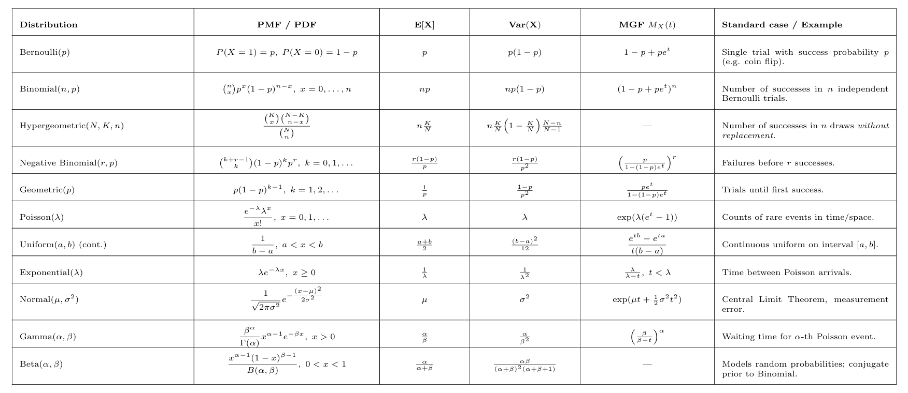

Relationships Between Distributions
===================================

-   **Binomial $\to$ Poisson:** If $n$ is large and $p$ is small such
    that $np=\lambda$ (fixed), then
    $$\text{Binomial}(n,p) \;\approx\; \text{Poisson}(\lambda).$$

-   **Poisson $\to$ Normal:** If $\lambda$ is large, then
    $$\text{Poisson}(\lambda) \;\approx\; N(\mu=\lambda, \sigma^2=\lambda).$$

-   **Binomial $\to$ Normal:** If $n$ is large, then
    $$\text{Binomial}(n,p) \;\approx\; N(np, np(1-p)).$$

-   **Geometric and Negative Binomial:** Geometric($p$) is a special
    case of Negative Binomial with $r=1$.

-   **Exponential and Gamma:** Sum of $k$ independent
    $\text{Exponential}(\lambda)$ random variables follows
    $$\text{Gamma}(k, 1/\lambda).$$

-   **Normal and $\chi^2$:** If $Z \sim N(0,1)$, then
    $Z^2 \sim \chi^2(1)$. More generally, the sum of squares of $k$
    independent $N(0,1)$ random variables gives $\chi^2(k)$.

-   **Gamma and Exponential:** Exponential($\lambda$) is a special case
    of Gamma with shape $k=1$.

-   **Beta and Binomial:** The Beta distribution is the *conjugate
    prior* of the Binomial distribution in Bayesian statistics.

-   **Central Limit Theorem (CLT):** The sum (or average) of i.i.d.
    random variables with finite variance converges in distribution to a
    Normal distribution as $n \to \infty$.

-   **Poisson process links:**

    -   Counts in fixed time $\to$ Poisson.

    -   Time between events $\to$ Exponential (Negative Exponential).

    -   Waiting time for $k$ events $\to$ Gamma.
